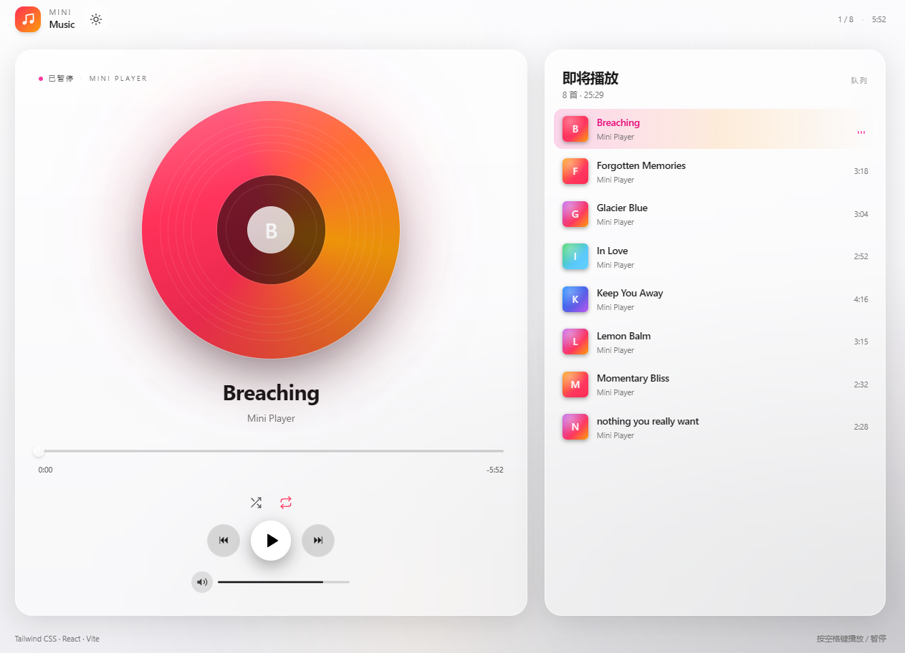
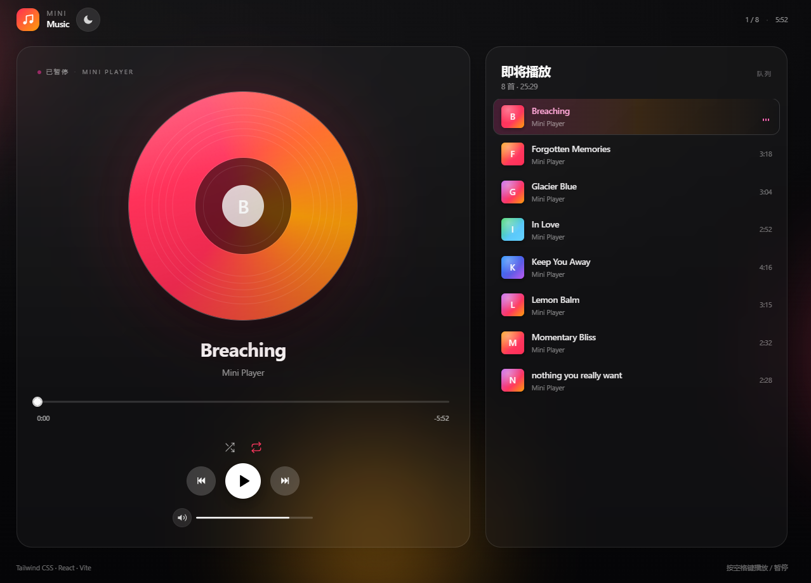

# 🎵 Mini Player

一款迷你版、Apple Music 风格的 Web 音乐播放器，基于 **React 18 + Tailwind CSS v4 + Vite** 构建。

> 🚀 **Vibe-coded** — 本项目从设计到实现，全程通过 *vibe coding*（意念驱动的 AI 协作）方式完成：让创意与心流始终走在前面，把模板代码交给模型处理。

> 融合 "Aurora × Apple Music" 视觉风格: 毛玻璃质感、Now Playing 布局、按歌曲切换的极光渐变、旋转黑胶唱片、脉冲均衡器，以及手动明 / 暗主题切换。

**语言:** [English](./README.md) | 简体中文

[](./LICENSE)
[](https://react.dev)
[](https://vitejs.dev)
[](https://tailwindcss.com)
[](./tests)
[](#development-zh)
[](#development-zh)


---

## ✨ 功能特性

- **模块化组件树**: `MusicPlayer`、`PlayerControls`、`ProgressBar`、`Playlist`、`ThemeToggle`。每个组件都维护自己的状态与样式。
- **使用 React Context 管理全局状态**: `<PlayerProvider>` 暴露 `currentTrack`、`isPlaying`、`currentTime`、`duration`、`volume`、`shuffleOn`、`repeatMode`、`played`，以及 `toggle`、`next`、`prev`、`seek`、`selectIndex`、`setVolume`、`setShuffleOn`、`cycleRepeat`、`stop` 等操作方法。
- **60 / 40 响应式双栏布局**: 在桌面端保持双栏展示，在移动端会自然折叠为单栏。
- **交互式进度条**: 支持点击跳转、拖拽快进/回退、实时预览，以及完整键盘支持（`←` / `→` 为 ±5 秒，`Home` / `End` 跳到两端）。点击和指针松开都会派发 `mini-player:seek` 事件，确保与 `<audio>.currentTime` 保持同步。
- **三键传输控制区**: 上一首 / 播放 / 下一首集中排列，其中上一首和下一首使用更小的圆形玻璃按钮。上方额外提供更克制的 **shuffle** 和 **repeat** 控件（off → list → one）。
- **按下拖动式音量滑块**: 点击轨道即可设置音量，只有在鼠标按下时滑块才会跟随指针移动，悬停不会误触。包含静音切换和键盘控制。
- **自动加载播放列表**: 数据来自 `public/songs/manifest.json`。当前播放曲目会显示三段式均衡器动画，已播放曲目会有淡出效果。
- **Apple 系统字体栈**: 使用 SF Pro Display / Text，并启用次像素抗锯齿。
- **手动明 / 暗主题切换**: 通过 `localStorage` 持久化保存。Tailwind v4 的 `dark:` 变体通过 `@custom-variant dark` 以 class 模式启用，因此手动切换会覆盖系统主题偏好。
- **细腻微交互动画**: 包括播放按钮悬停缩放、进度圆点脉冲、呼吸式极光光团、播放时旋转黑胶，以及当前曲目上的均衡器脉冲动画。

---

## 📸 截图

> 你可以将自己的截图放入 `docs/` 目录，并在这里添加链接。默认头图位于 `src/assets/hero.png`。

| 浅色主题 | 深色主题 |
| --- | --- |
|  |  |

---

## 🚀 快速开始

### 环境要求

- **Node.js ≥ 18**（Vite 8 的最低基线）
- **npm**（也可使用 pnpm / yarn，下方示例使用 npm）

### 安装并运行

```bash
git clone https://github.com/CodingLight/mini-player.git
cd mini-player
npm install
npm run dev
```

打开 <http://localhost:5173> 即可开始体验。

### 生产构建

```bash
npm run build      # 构建产物输出到 dist/
npm run preview    # 本地预览生产构建结果
```

---

<a id="development-zh"></a>

## 🧪 开发

| 命令 | 说明 |
| --- | --- |
| `npm run dev` | 启动带 HMR 的 Vite 开发服务器 |
| `npm run build` | 构建生产版本到 `dist/` |
| `npm run preview` | 本地预览生产构建 |
| `npm test` | 单次运行完整 Vitest 测试套件 |
| `npm run test:watch` | 以 watch 模式运行 Vitest |
| `npm run lint` | 使用 ESLint 检查整个项目 |

### 测试

**共 40 个测试**，分布在 5 个文件中，当前全部通过:

| 文件 | 覆盖内容 |
| --- | --- |
| `formatTime.test.js` | `mm:ss` 格式化、补零、非法输入处理（`NaN`、负数、`undefined`） |
| `palette.test.js` | 哈希结果确定性、调色板边界、缺失标题时的回退逻辑 |
| `PlayerContext.test.jsx` | 初始状态、`load`、`toggle`、`next`（loop / shuffle / off）、`prev`（3 秒规则）、`selectIndex` 自动播放、`seek` 边界限制、`setVolume` 边界限制、`setShuffleOn`、`cycleRepeat`、`stop`、`markPlayed` 幂等性 |
| `ProgressBar.test.jsx` | 渲染、点击跳转、指针拖拽（down → move → up）、键盘方向键、Space 隔离、**`mini-player:seek` 事件派发回归测试** |
| `PlayerControls.test.jsx` | 渲染、播放 / 暂停、上一首 / 下一首、静音切换、全局 Space 快捷键、shuffle 按钮 `aria-pressed`、repeat 循环（off / all / one）、**音量滑块仅在按下时跟随指针** |

---

## 📁 项目结构

```text
mini-player/
├── public/
│   └── songs/
│       ├── manifest.json            # 播放列表数据，由 Playlist.jsx 读取
│       └── *.wav                    # 音频文件
├── src/
│   ├── components/
│   │   ├── MusicPlayer.jsx          # 主外壳，包含 60/40 布局、极光背景、黑胶唱片视觉
│   │   ├── PlayerControls.jsx       # 播放 / 暂停、⏮ / ⏭、shuffle / repeat、音量滑块、Space 快捷键
│   │   ├── ProgressBar.jsx          # 点击 / 拖拽 / 键盘控制 + mini-player:seek 事件
│   │   ├── Playlist.jsx             # 自动加载列表、当前项高亮、均衡器、已播放状态
│   │   └── ThemeToggle.jsx          # 太阳 / 月亮玻璃按钮，切换 light ↔ dark
│   ├── context/
│   │   ├── PlayerContext.jsx        # <PlayerProvider>，提供全局播放器状态与操作
│   │   ├── context.js               # PlayerContext 对象（为 react-refresh 拆分）
│   │   ├── usePlayer.js             # usePlayer() hook（为 react-refresh 拆分）
│   │   ├── theme.jsx                # <ThemeProvider>，管理 light / dark 和 localStorage
│   │   ├── themeContext.js          # ThemeContext 对象（为 react-refresh 拆分）
│   │   └── useTheme.js              # useTheme() hook（为 react-refresh 拆分）
│   ├── hooks/
│   │   └── useAudioPlayer.js        # 副作用桥接层，连接 <audio> 与 Context，并感知 repeat 模式
│   ├── utils/
│   │   ├── formatTime.js            # mm:ss 时间格式化工具
│   │   └── palette.js               # 标题哈希映射到精选渐变调色板
│   ├── index.css                    # Tailwind v4 @theme、Apple 颜色令牌、@custom-variant dark
│   ├── App.jsx                      # 包裹 <ThemeProvider> 与 <PlayerProvider>
│   └── main.jsx                     # React 入口文件
├── tests/
│   ├── setup.js                     # Vitest 配置与 jsdom polyfill（PointerEvent、Pointer Capture、HTMLMediaElement）
│   ├── formatTime.test.js
│   ├── palette.test.js
│   ├── PlayerContext.test.jsx
│   ├── ProgressBar.test.jsx
│   └── PlayerControls.test.jsx
├── index.html
├── vite.config.js
├── vitest.config.js
├── eslint.config.js
├── package.json
├── LICENSE
├── README.md
└── README_zh.md
```

---

## 🎨 自定义

- **添加歌曲**: 将音频文件放入 `public/songs/`，并在 `public/songs/manifest.json` 中新增条目:

  ```json
  {
    "id": "my-track",
    "title": "My Track",
    "artist": "Artist Name",
    "duration": 214,
    "src": "/songs/My Track.wav"
  }
  ```

- **调整极光调色板**: `src/utils/palette.js` 中维护了一组按 `hashString(title)` 映射的精选渐变色。向 `PALETTES` 添加新渐变即可扩大选择范围。
- **修改主题令牌**: Apple 系配色、字体栈、阴影和极光动画关键帧都定义在 `src/index.css` 的 `@theme` 代码块中。
- **主题持久化机制**: `src/context/theme.jsx` 会优先读取 `localStorage`，然后再回退到 `prefers-color-scheme`。如果你希望始终跟随系统主题，可以移除 `localStorage` 分支。
- **Context 与音频桥接**: 唯一处理副作用的模块是 `src/hooks/useAudioPlayer.js`。它通过自定义 `mini-player:seek` 窗口事件，让进度条无需通过层层传递 ref 就能控制音频元素。

---

## 🌐 浏览器支持

目标环境为现代版 Chromium、Firefox 和 Safari。项目仅依赖以下浏览器能力:

- `HTMLAudioElement`
- `backdrop-filter`（CSS）
- `localStorage`
- `prefers-color-scheme`（仅作为首次挂载时的回退判断）
- CSS 自定义属性与 `@custom-variant`（Tailwind v4）

以上能力自 2022 年起都已属于主流基线能力。

---

## 🛣️ 路线图

- [ ] 拖拽调整播放列表顺序
- [ ] 将 `currentIndex` / `currentTime` 持久化到 `localStorage`，支持刷新后恢复
- [ ] 可选歌词面板
- [ ] 专辑封面上的可视化效果（Web Audio API）

---

## 🤝 参与贡献

欢迎贡献代码。为了更顺畅地协作，建议按以下流程进行:

1. Fork 仓库并创建功能分支: `git checkout -b feat/your-feature`
2. 完成修改，并在适用时补充测试。
3. 运行 `npm run lint` 和 `npm test`，确保两者都通过。
4. 提交 Pull Request，并说明动机与实现思路。

如果是非小型改动，请先提交 issue 讨论设计方案，再开始实现。

---

## 📄 许可证

本项目基于 **MIT License** 发布。完整内容见 [`LICENSE`](./LICENSE)。

你可以在遵守 MIT 标准条款的前提下，自由使用、复制、修改、合并、发布、分发、再许可和 / 或销售本软件的副本。

---

## 🙏 致谢

- 感谢 Apple Music 为本项目提供视觉语言灵感
- 感谢 Pedro 提供本项目使用的音乐素材: https://github.com/machadop1407
- 感谢 [Tailwind CSS](https://tailwindcss.com) 及 Tailwind v4 alpha / beta 社区
- 感谢 [Vitest](https://vitest.dev) 和 [Testing Library](https://testing-library.com) 提供测试工具链
- 感谢所有让这类项目成为可能的开源维护者
